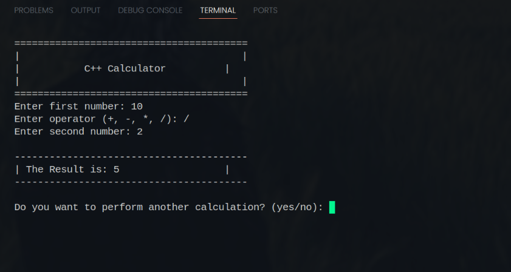

# Simple C++ Calculator



A simple command-line calculator built with C++. This was my first project after learning the basics of C++ in August 2024.

---

## 🚀 Features

-   Performs basic arithmetic operations: Addition (`+`), Subtraction (`-`), Multiplication (`*`), and Division (`/`).
-   Handles invalid input, such as division by zero and unsupported operators.
-   Allows users to perform multiple calculations in a single session.

---

## 🛠️ Tech Stack

-   **Language:** C++
-   **Libraries:** `iostream`, `string`, `cctype`

---

## ⚙️ How to Run

1.  **Compile the code:**
    ```bash
    g++ calculator.cpp -o calculator
    ```

2.  **Run the executable:**
    ```bash
    ./calculator
    ```

